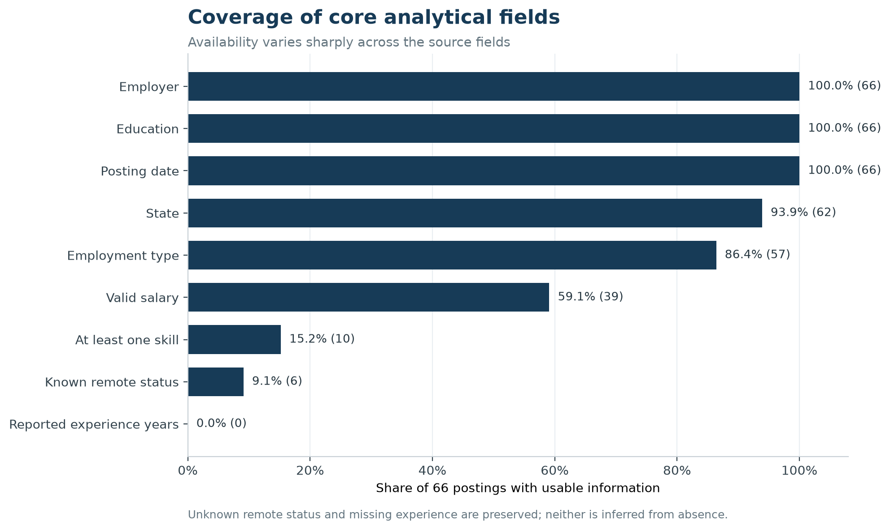

## Purpose

This page documents how the raw MET Employability Career Match postings were converted into a posting-level analytical dataset for the team's selected market. The final panel contains **66 unique postings** in the **Software Publishers** industry and the **Data Scientist plus adjacent AI/ML technical** career pathway.

The design deliberately separates the core occupation from adjacent roles. Only one posting was a core Data Scientist role; the other 65 were explicitly labeled AI or machine-learning technical roles. This preserves a usable market sample without presenting every AI/ML posting as a Data Scientist job.

## Analytical scope

| Dimension | Operational definition |
|---|---|
| Selected industry | Software Publishers, standardized to 2022 NAICS `513210` |
| Career pathway | Core Data Scientist roles plus adjacent AI/ML engineers, developers, scientists, architects, and interns |
| Filter window | Posting dates from January 1 through July 31, 2026 |
| Observed dates in final panel | June 3 through July 21, 2026 |
| Unit of analysis | One unique job posting ID |
| Final sample | 66 postings: 1 core and 65 adjacent |

## Source data and relational restructuring

The source consists of 17 Parquet partitions containing **165,386 rows and 115 fields**. The lab restructuring step separated those fields into six relational CSV tables:

1. `job_postings.csv`
2. `company.csv`
3. `job_location.csv`
4. `soc_details.csv`
5. `lot_details.csv`
6. `naics_details.csv`

Each posting-level child table uses job `ID` as its key. The company table uses `COMPANY_ID`; every posting's company key matched a company record. LOT source fields were not present in this release, so the required LOT table was created with job IDs and documented blank LOT attributes rather than fabricated values.

## Industry-code normalization

The source audit found a systematic coding issue that required explicit treatment:

| Audit result | Value |
|---|---:|
| Final-panel jobs found in `naics_details.csv` | 66 |
| Raw values containing `513210` | 0 |
| Raw values containing legacy `511210` | 0 |
| Raw values named `Software Publishers` | 66 |
| Raw code/name pair | `513200` / `Software Publishers` |

The official 2022 NAICS hierarchy places Software Publishers under group `5132`, industry `51321`, and six-digit U.S. industry `513210` [@census2022]. The source value `513200` therefore behaves as a zero-padded representation of group `5132`, not as a valid six-digit leaf code. Records were admitted only when the canonical source name was Software Publishers, then the analytical code was standardized to `513210`. The raw source result remains separately auditable in `target_naics_source_audit.csv`.

::: {.callout-important}
The raw data did **not** contain code `513210`. The panel's `513210` value is a documented taxonomy normalization supported by the canonical industry name and the official NAICS hierarchy; it is not a claim about the unmodified source code.
:::

## Career-pathway filter

Filtering was applied to titles and occupation mappings, not to the full job description. This avoids admitting a posting merely because its description mentions a data-science team or an AI skill.

The mutually exclusive role rules were applied in this order:

1. **Core Data Scientist:** an explicit Data Scientist/Data Science role title or a Data Scientists SOC/O\*NET mapping.
2. **Adjacent scientist roles:** applied, decision, or research-scientist titles with an explicit data-science, AI, or ML signal.
3. **Adjacent technical roles:** an explicit `machine learning`, `ML`, `artificial intelligence`, or standalone `AI` title signal combined with engineer, developer, scientist, architect, or intern language.
4. **Analytics Engineer:** an explicit Analytics Engineer title.

Generic software jobs with AI/ML only in the description were excluded. An `.ai` company or product-domain suffix alone was also excluded from the AI rule. The resulting cohort contains 54 AI technical roles, 11 machine-learning technical roles, and one Data Scientist role; none of the other allowed segments appeared in the final sample.

## Cleaning decisions

| Variable group | Cleaning rule | Result or audit decision |
|---|---|---|
| Posting IDs and duplicates | Drop blank IDs; for repeated IDs retain the record with the latest update timestamp. Flag, but do not automatically delete, identical employer-title-date-location fingerprints. | All 165,386 source IDs were nonmissing and unique; zero exact-ID rows were removed and zero final near-duplicates were flagged. |
| Dates | Safely parse posting and expiration values; malformed or blank values remain missing. Apply the stated posting-date window. | The final observed range is June 3–July 21, 2026. |
| Salary | Parse numeric bounds, order reversed bounds, and annualize annual/hourly/weekly/monthly/daily periods. Treat nonpositive values as missing and retain only plausible annual values from $15,000 to $1,000,000. | 39 usable midpoints; 18 zero placeholders set to missing; 9 otherwise missing. |
| Salary outliers | Apply a 1.5-IQR flag after plausibility cleaning. Preserve the observations so legitimate high-paying senior AI roles are not silently discarded. | Five observations flagged and retained; audit limits were $124,026.25 and $306,384.25. |
| Experience | Safely convert reported minimum and maximum years. Do not infer numeric years when absent. Create a separate seniority proxy from explicit title language. | All 66 postings lack reported experience years. The proxy is clearly labeled and is not an imputation. |
| Education | Normalize minimum education into consistent degree categories. | 63 bachelor's-degree and 3 master's-degree requirements. |
| Employment type | Normalize explicit source labels; use title/internship fields to identify internships; preserve unknown values. | 54 full-time, 3 internship, and 9 unknown. |
| Remote status | Map only explicit remote, hybrid, or onsite source labels. | 6 remote and 60 unknown. Unknown is not recoded as onsite. |
| Geography | Trim city, county, and state; form a city/state label when available; otherwise retain a source-location fallback. | State is usable for 62 postings; four remain unspecified. |
| Employers | Preserve source company labels in the panel. Standardize obvious domain-style labels only in presentation summaries. | Raw labels remain available for audit. |
| Skills | Parse and deduplicate structured skill arrays. If absent, supplement them with a controlled keyword dictionary applied to the title and description. Track the extraction source. | Only 10 postings have at least one usable skill: 6 from structured fields and 4 from controlled description matches. |
| Industry and occupation | Preserve SOC/O\*NET fields and record the inclusion rule. Standardize the documented Software Publishers source group to `513210`. | Every final posting has an explicit role-match reason and industry-match method. |
| Missing values | Keep meaningful missingness as null or `Unknown`; do not fill absent salary, experience, remote, skill, or location values with invented values. | Missingness is part of the reported baseline and limits interpretation. |

## Data completeness

{fig-alt="Posting date, employer, and education have 100 percent coverage. State has 93.9 percent, employment type 86.4 percent, salary 59.1 percent, skills 15.2 percent, remote status 9.1 percent, and experience years zero percent."}

The source supports a credible baseline for job volume, broad role mix, education, state, and the subset with published salary. It does not support a reliable years-of-experience distribution, a true remote-versus-onsite split, or a comprehensive skill ranking. Those gaps are displayed rather than hidden.

## Output files

The preparation workflow creates the following reusable products:

- `data/processed/career_market_panel.csv`: one row per filtered posting.
- `data/processed/career_market_skills.csv`: normalized posting-skill bridge table.
- `data/processed/career_market_data_dictionary.csv`: variable definitions and cleaning notes.
- `data/processed/career_market_cleaning_audit.csv`: row counts, missingness, and salary checks.
- `data/processed/target_naics_source_audit.csv`: raw-versus-standardized NAICS evidence.
- `outputs/step2/*.csv`: website summary tables created from the final panel.
- `figures/step2/*.png`: static figures used on the baseline pages.

The scripts `restructure_data.py`, `prepare_market_panel.py`, `audit_naics_scope.py`, and `build_step2_outputs.py` make the workflow reproducible. Large raw Parquet files and lab-scale relational exports should remain excluded from Git.

## Interpretation limits

This is a narrow, source-defined market snapshot. The 66 records cover only postings observed from June 3 through July 21 despite the broader filter window. Source industry tagging was not independently reclassified employer by employer, so the panel can contain firms whose primary business is not obviously software publishing. Results describe the filtered posting sample, not all U.S. hiring or the probability that a particular applicant will receive an offer.

