```{python}
#| label: setup
#| include: false

from pathlib import Path

import pandas as pd
import plotly.express as px

from scripts.plot_theme import apply_plotly_theme
from scripts.plot_theme import PLOTLY_COLORS

FIGURE_DIR = Path("figures/step3")
FIGURE_DIR.mkdir(parents=True, exist_ok=True)
```

## Baseline at a glance

This page describes the **66 distinct postings** remaining after the documented industry, pathway, date, and cleaning rules. The sample is a short observed snapshot—June 3 through July 21, 2026—within the January–July analysis window.

| Indicator | Baseline result |
|---|---:|
| Core Data Scientist postings | 1 (1.5%) |
| Adjacent AI/ML technical postings | 65 (98.5%) |
| Senior or Staff/Principal/Lead title signals | 53 (80.3%) |
| Postings with a usable salary midpoint | 39 (59.1%) |
| Median annual salary midpoint | $215,000 |
| Explicitly remote postings | 6 (9.1%) |
| Remote status unknown | 60 (90.9%) |

::: {.callout-note}
The source stored the canonical Software Publishers name with raw code `513200`. The analytical code is standardized to official 2022 NAICS `513210` under the documented procedure on the Data Preparation page [@census2022].
:::

## Job volume and pathway composition

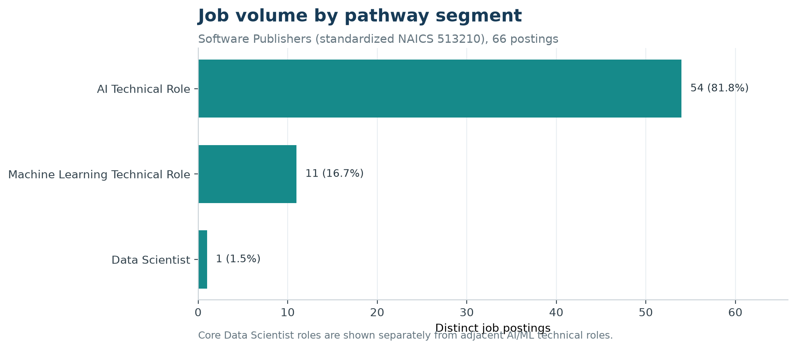{fig-alt="The 66-posting sample contains 54 AI technical roles, 11 machine-learning technical roles, and one Data Scientist role."}

The clearest market signal is scarcity of the exact target title. Only **one** posting qualified as a core Data Scientist role. Demand is much larger for adjacent implementation-oriented work: AI technical roles account for 54 postings and machine-learning technical roles account for 11. For career planning, this supports treating AI/ML engineering as a realistic adjacent pathway while continuing to label it separately from data science.

## Salary distribution

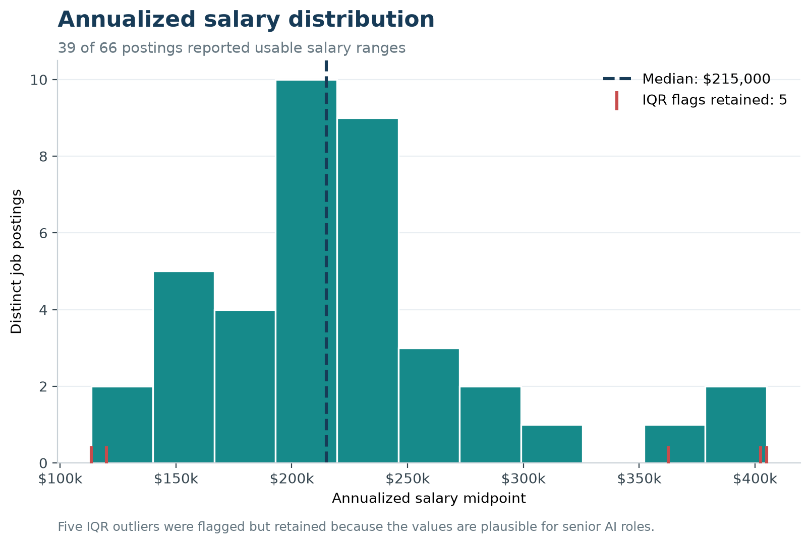{fig-alt="Usable annualized salary midpoints for 39 postings range from 113,500 dollars to 405,000 dollars, with a median of 215,000 dollars. Five observations are flagged as IQR outliers and retained."}

Among the 39 postings with usable salary data, the annualized midpoint has a **median of $215,000**, a mean of **$221,789**, and a range from **$113,500 to $405,000**. The wide upper tail is consistent with the sample's concentration in senior and staff-level roles. Five values fall outside the 1.5-IQR limits; they remain in the dataset because inspection showed plausible compensation for an internship at the low end and advanced AI roles at the high end. Salary conclusions apply only to the 59.1% of postings with usable reported pay.

## Hiring geography

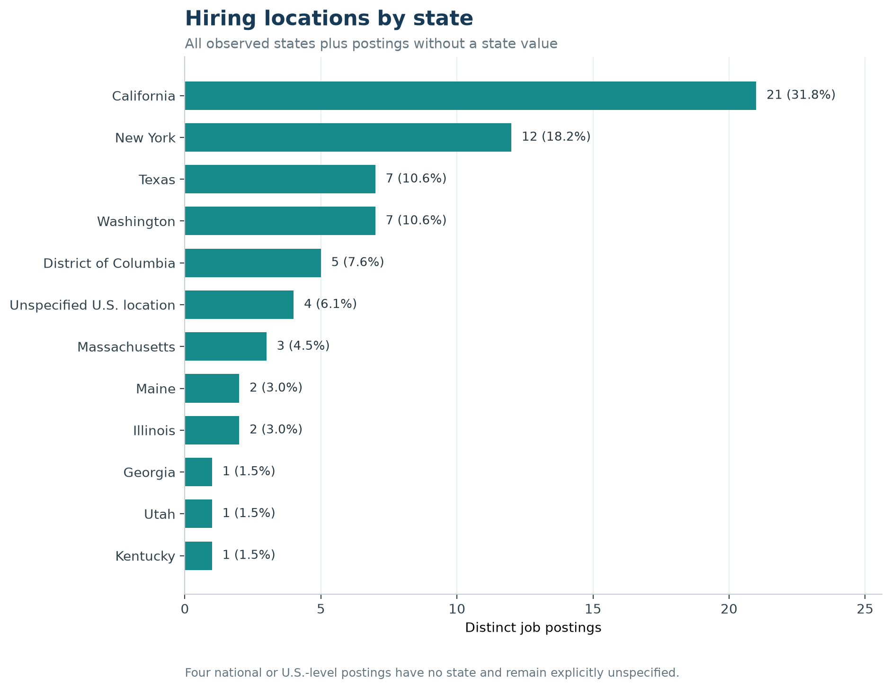{fig-alt="California has 21 postings, New York 12, Texas and Washington seven each, District of Columbia five, and four postings have no state."}

California leads with **21 postings (31.8%)**, followed by New York with **12 (18.2%)**. Together they represent half of the sample. Texas and Washington each have seven postings, and the District of Columbia has five. Four records describe a national or U.S.-level location without a usable state; they remain explicitly unspecified rather than being assigned to a state.

## Experience requirements

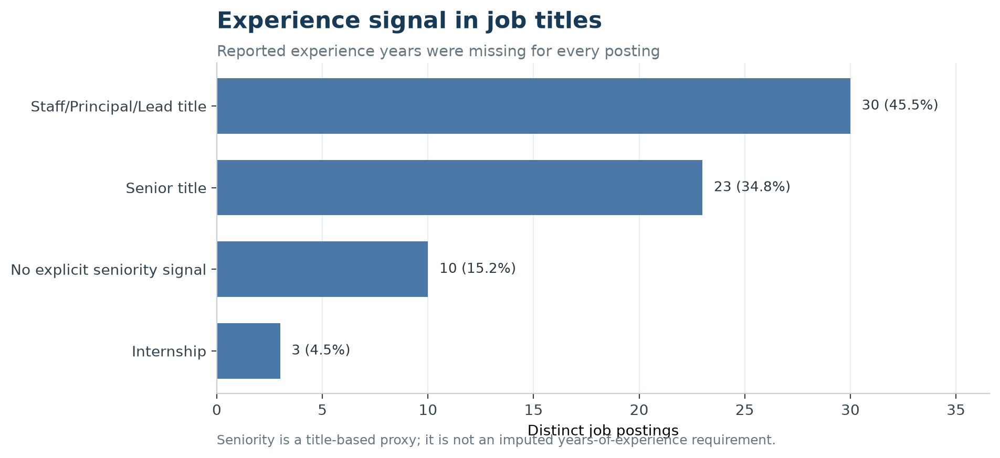{fig-alt="Thirty postings have Staff, Principal, or Lead title signals; 23 have Senior title signals; 10 have no explicit signal; and three are internships."}

The raw experience-year fields are missing for all 66 postings, so a conventional years-of-experience distribution cannot be reported. Explicit title language nevertheless shows that **53 postings (80.3%)** are senior or Staff/Principal/Lead roles. Ten titles have no explicit seniority signal, and three are internships. This is a role-level signal, not a conversion to assumed years.

## Remote-work reporting

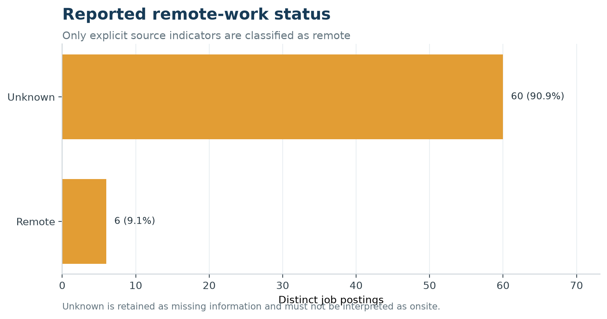{fig-alt="Six postings are explicitly remote and 60 have unknown remote status."}

Only six postings are explicitly marked remote. The other 60 are **unknown**, not confirmed onsite. Consequently, the defensible result is that at least 9.1% of the sample is explicitly remote; the dataset cannot support a true remote-versus-onsite market share.

## Top employers

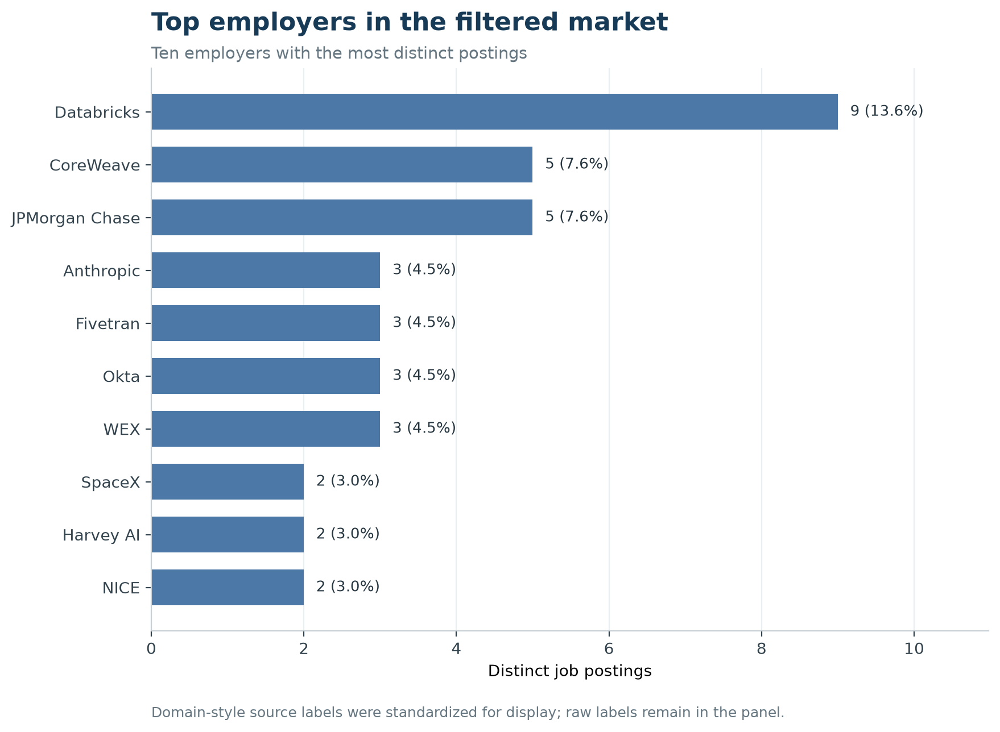{fig-alt="Databricks has nine postings. JPMorgan Chase and CoreWeave have five each. WEX, Anthropic, Fivetran, and Okta have three each."}

Databricks is the largest observed employer with **nine postings (13.6%)**. JPMorgan Chase and CoreWeave each have five; WEX, Anthropic, Fivetran, and Okta each have three. Obvious domain-style source labels were normalized for this display only, while original company labels remain in the analytical panel. Employer rankings inherit the source's industry assignments; the project did not independently reclassify each firm's primary industry.

## Education requirements

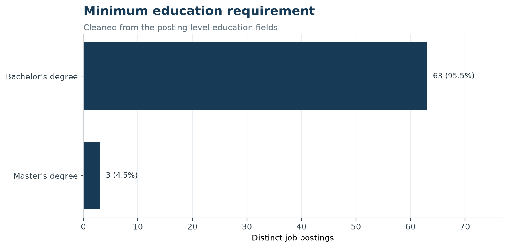{fig-alt="Sixty-three postings require a bachelor's degree and three require a master's degree."}

The cleaned minimum requirement is a bachelor's degree for **63 postings (95.5%)** and a master's degree for three. This variable is much more complete than experience, remote, or skill fields and suggests that a bachelor's degree is the dominant formal education threshold in this filtered sample.

## Skills evidence

A market-wide top-skills chart would be misleading here. Only **10 of 66 postings (15.2%)** contain a usable normalized skill: six through structured source fields and four through controlled description-keyword extraction. Individual skill counts never exceed two postings. The current skill table should be retained for transparency and later gap analysis, but it is not strong enough to characterize overall market demand without a richer source or improved description extraction.

## What this baseline means

For this source and time period, the selected market is best characterized as a small, high-paying, senior-skewed AI/ML technical market rather than a broad entry-level Data Scientist market. The strongest actionable finding is the role mix: students targeting Software Publishers should evaluate adjacent AI/ML engineering readiness as well as exact Data Scientist titles. Salary and geography provide useful directional context; remote, experience-year, and skill conclusions remain constrained by source completeness.

## Step 3 Exploratory Data Analysis

The updated Lightcast source contains 72,498 postings. Applying the exact
Software Publishers industry code (NAICS 513210), the May–September 2024 date
window, and the documented title-based pathway rules produces **10 distinct
postings**. One posting is an explicit core Data Scientist role and nine are
adjacent AI, machine-learning, analytics, or applied-science roles.

::: {.callout-warning}
This is a narrowly defined pathway sample, not a market-wide estimate. Counts,
percentages, salaries, and skill frequencies below describe these 10 audited
postings only. Detailed SOC labels were not used as a standalone inclusion rule
because they mapped 1,034 of the 1,037 industry postings to Data Scientists even
when the job titles did not support that interpretation.
:::

### Posting volume over time

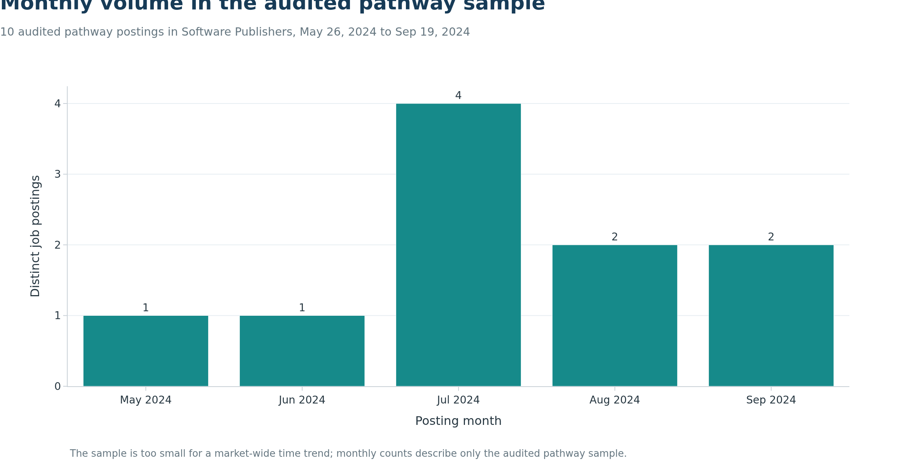{fig-alt="The audited sample contains one posting in May, one in June, four in July, two in August, and two in September 2024."}

July contains four of the 10 retained postings, the largest monthly count in
the sample. May and June contain one each, while August and September contain
two each. With only 10 observations, these values should not be interpreted as
evidence of a broader seasonal or growth trend.

### Core and adjacent pathway roles

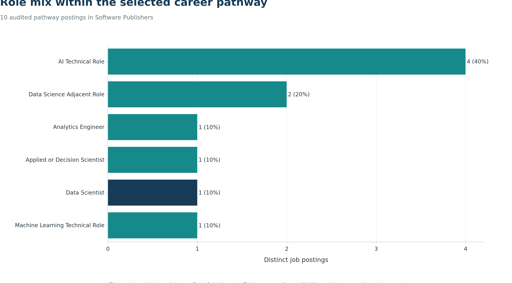{fig-alt="The sample contains four AI technical roles, two data-science-adjacent roles, and one each in machine learning, core data science, applied or decision science, and analytics engineering."}

Only one posting has an explicit core Data Scientist title. The largest segment
is AI Technical Role with four postings. Two postings are Data Science Adjacent
Roles, and the remaining three adjacent segments contain one posting each. The
result supports evaluating adjacent AI and analytics pathways, but those roles
remain labeled separately because their responsibilities and skill profiles are
not interchangeable with core data science.

### Reported salary midpoints

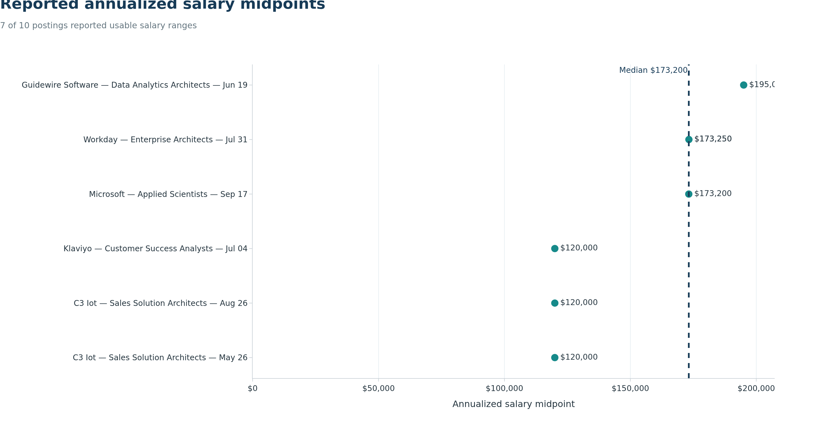{fig-alt="Seven adjacent-role postings report usable annualized salary midpoints ranging from 120,000 to 195,000 dollars, with a median of 173,200 dollars."}

Seven postings report usable annualized salary ranges. Their midpoints range
from **$120,000 to $195,000**, with a median of **$173,200**. All seven salary
observations belong to adjacent roles; the one core Data Scientist posting has
no usable salary. The salary results therefore describe reported pay among the
adjacent-role subset and should not be presented as an estimate for core Data
Scientist positions.

### Geographic distribution

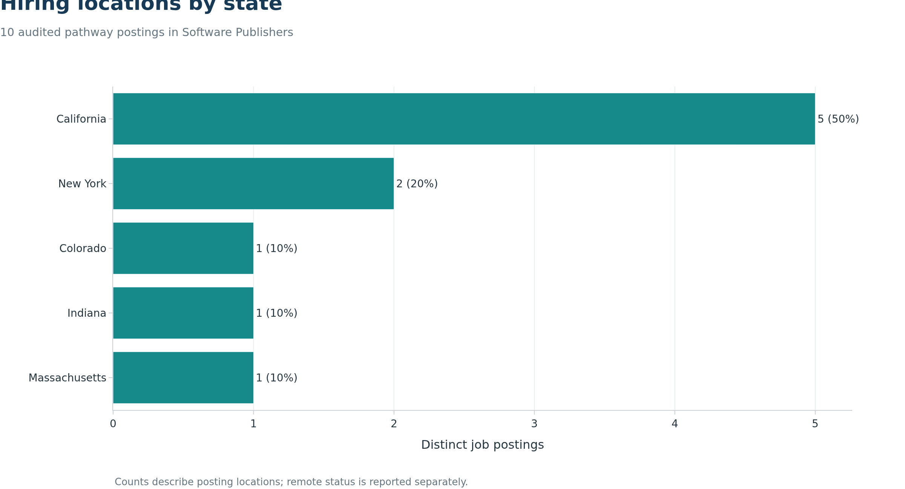{fig-alt="California contains five postings, New York contains two, and Colorado, Indiana, and Massachusetts contain one each."}

California accounts for five postings and New York for two. Colorado, Indiana,
and Massachusetts contribute one posting each. This concentration indicates
where the audited employers advertised these particular roles; it is not a
national state-level demand ranking.

### Employers in the audited sample

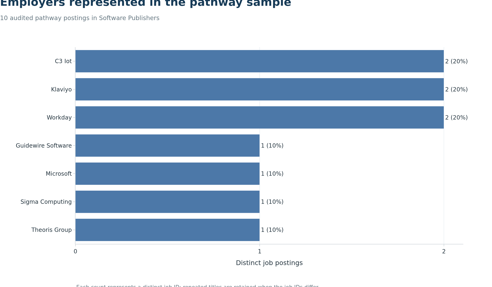{fig-alt="C3 IoT, Klaviyo, and Workday have two postings each; four other employers have one each."}

C3 IoT, Klaviyo, and Workday each contribute two postings. Guidewire Software,
Microsoft, Sigma Computing, and Theoris Group each contribute one. Because the
sample is small, employer counts are descriptive and may reflect repeated
locations or posting dates rather than sustained hiring volume.

### Remote-work reporting

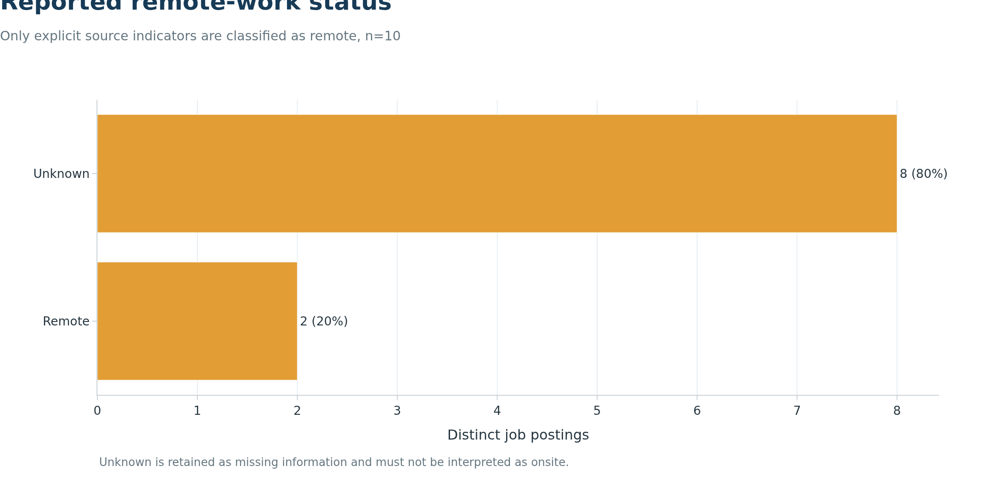{fig-alt="Two postings are explicitly remote and eight have unknown remote status."}

Two postings are explicitly identified as remote. The remaining eight have
unknown remote status and are not assumed to be onsite. The defensible result
is that at least 20% of the audited sample is explicitly remote; the data cannot
support a complete remote-versus-onsite comparison.

### Skill demand

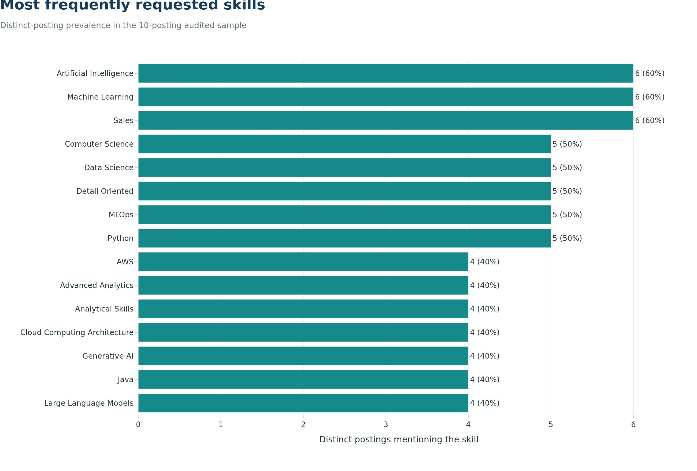{fig-alt="Artificial Intelligence, Machine Learning, and Sales appear in six postings each. MLOps, Python, Data Science, Computer Science, and Detail Oriented appear in five each."}

Artificial Intelligence, Machine Learning, and Sales each appear in six of the
10 postings. MLOps, Python, Data Science, Computer Science, and Detail Oriented
each appear in five. The combination of technical and customer-facing skills
reflects the sample's strong representation of solution-architecture and
enterprise-AI roles. Skill percentages do not sum to 100% because a posting can
request many skills. Equivalent labels such as `Generative AI` and
`Generative Artificial Intelligence` are consolidated before counting.

### Data completeness

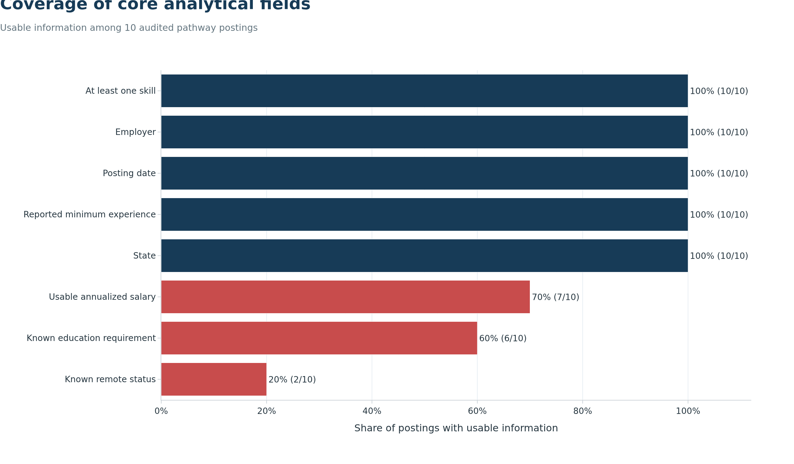{fig-alt="Posting date, employer, state, minimum experience, and skills are complete. Salary is usable for seven postings, education for six, and remote status for two."}

Posting date, employer, state, reported minimum experience, and skills are
available for all 10 postings. Salary is usable for seven, education for six,
and remote status for two. The analysis retains missing values explicitly and
does not infer salary, education, or remote status from other fields.
