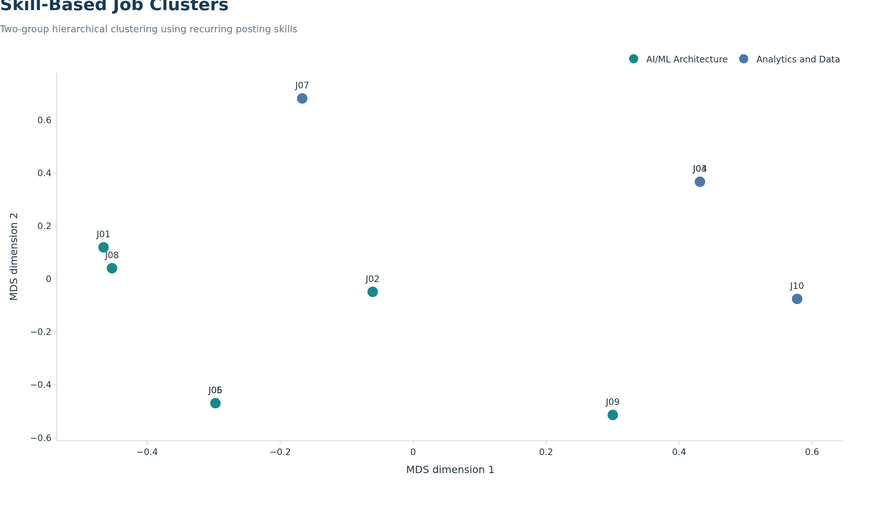
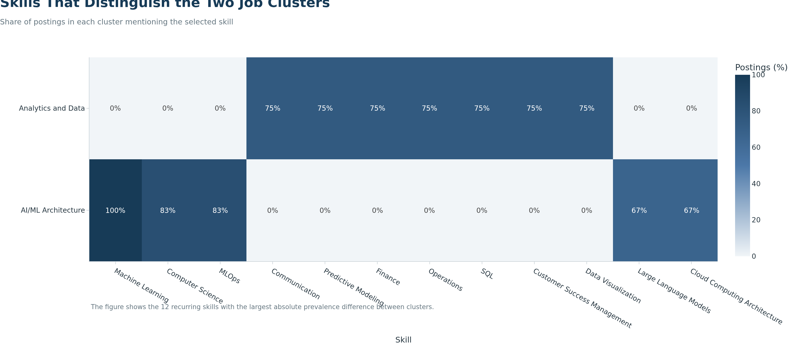

## Objective

We use unsupervised learning to examine whether the audited job postings form
meaningful groups based on their required skills. Our goal is descriptive: we
want to identify different career pathways within the selected software
publisher market, not predict outcomes for the broader labor market.

Because our final panel contains only 10 postings, a supervised salary or
hiring model would not support a credible train-test evaluation. We therefore
use hierarchical clustering and treat the results as exploratory evidence.

## Model Data

```{python}
#| label: ml-model-data
#| echo: true

from pathlib import Path

import numpy as np
import pandas as pd
from sklearn.cluster import AgglomerativeClustering
from sklearn.manifold import MDS
from sklearn.metrics import pairwise_distances
from sklearn.metrics import silhouette_score

import plotly.graph_objects as go

from plotly_theme import BLUE
from plotly_theme import NAVY
from plotly_theme import TEAL
from plotly_theme import apply_job_market_theme

panel_path = Path("data/processed/step3/career_market_panel.csv")
skills_path = Path("data/processed/step3/career_market_skills.csv")
figure_dir = Path("figures/step3")
output_dir = Path("outputs/step3")

figure_dir.mkdir(parents=True, exist_ok=True)
output_dir.mkdir(parents=True, exist_ok=True)

market_panel = pd.read_csv(panel_path)
market_skills = pd.read_csv(skills_path)

if market_panel["JOB_ID"].duplicated().any():
    raise ValueError("The market panel must contain one row per JOB_ID.")

skill_aliases = {
    "Generative Artificial Intelligence": "Generative AI",
    "MLOps (Machine Learning Operations)": "MLOps",
    "Kafka": "Apache Kafka",
    "Docker (Software)": "Docker"
}

market_skills["MODEL_SKILL"] = market_skills["SKILL"].replace(
    skill_aliases
)

market_skills = market_skills.drop_duplicates(
    subset=["JOB_ID", "MODEL_SKILL"]
)

skill_frequency = (
    market_skills
    .groupby("MODEL_SKILL")["JOB_ID"]
    .nunique()
    .sort_values(ascending=False)
)

# Retain skills appearing in at least 3 of the 10 postings. This reduces the
# influence of one-off terms while keeping skills observed in at least 30% of
# the audited market panel.
model_skill_names = skill_frequency[
    skill_frequency >= 3
].index.tolist()

feature_matrix = (
    market_skills[
        market_skills["MODEL_SKILL"].isin(model_skill_names)
    ]
    .assign(PRESENT=1)
    .pivot_table(
        index="JOB_ID",
        columns="MODEL_SKILL",
        values="PRESENT",
        aggfunc="max",
        fill_value=0
    )
    .reindex(market_panel["JOB_ID"], fill_value=0)
)

if feature_matrix.shape[1] < 2:
    raise ValueError("Too few recurring skills are available for clustering.")

model_input_summary = pd.DataFrame({
    "Measure": [
        "Distinct postings",
        "Unique normalized skills",
        "Skills retained for modeling",
        "Minimum posting frequency"
    ],
    "Value": [
        market_panel["JOB_ID"].nunique(),
        market_skills["MODEL_SKILL"].nunique(),
        feature_matrix.shape[1],
        "3 postings (30%)"
    ]
})

model_input_summary
```

Each row of the modeling matrix represents one job posting. Each retained
skill is a binary feature: `1` means the posting lists the skill and `0` means
it does not. We use Jaccard distance because it compares shared presences in
binary data without treating two shared absences as evidence that postings are
similar.

## Selecting the Number of Clusters

```{python}
#| label: ml-cluster-selection
#| echo: true

distance_matrix = pairwise_distances(
    feature_matrix.to_numpy(dtype=bool),
    metric="jaccard"
)


def fit_agglomerative(distance_values, number_of_clusters):
    """Fit average-linkage clustering across scikit-learn versions."""
    try:
        model = AgglomerativeClustering(
            n_clusters=number_of_clusters,
            metric="precomputed",
            linkage="average"
        )
    except TypeError:
        model = AgglomerativeClustering(
            n_clusters=number_of_clusters,
            affinity="precomputed",
            linkage="average"
        )

    return model.fit_predict(distance_values)


candidate_results = []
candidate_labels = {}

for candidate_k in [2, 3, 4]:
    labels = fit_agglomerative(distance_matrix, candidate_k)
    label_counts = pd.Series(labels).value_counts()

    candidate_labels[candidate_k] = labels
    candidate_results.append({
        "Candidate Clusters": candidate_k,
        "Silhouette Score": silhouette_score(
            distance_matrix,
            labels,
            metric="precomputed"
        ),
        "Smallest Cluster": int(label_counts.min()),
        "Singleton Clusters": int((label_counts == 1).sum())
    })

model_comparison = pd.DataFrame(candidate_results)
model_comparison["Silhouette Score"] = model_comparison[
    "Silhouette Score"
].round(3)

model_comparison.to_csv(
    output_dir / "ml_model_comparison.csv",
    index=False
)

model_comparison
```

The three-cluster solution has the highest silhouette score, but it creates a
cluster containing only one posting. The four-cluster solution creates two
single-posting clusters. We select two clusters because both resulting groups
contain multiple observations and provide a more stable, interpretable career
comparison. This choice balances quantitative separation with the limitations
of our small sample.

## Final Cluster Solution

```{python}
#| label: ml-final-clusters
#| echo: true

selected_k = 2
raw_cluster_labels = candidate_labels[selected_k]

architecture_markers = [
    "Artificial Intelligence",
    "Machine Learning",
    "MLOps",
    "Solution Architecture",
    "Cloud Computing Architecture"
]

available_architecture_markers = [
    skill
    for skill in architecture_markers
    if skill in feature_matrix.columns
]

architecture_scores = {}

for cluster_number in sorted(set(raw_cluster_labels)):
    cluster_mask = raw_cluster_labels == cluster_number
    architecture_scores[cluster_number] = (
        feature_matrix.loc[
            cluster_mask,
            available_architecture_markers
        ]
        .mean()
        .mean()
    )

architecture_cluster_number = max(
    architecture_scores,
    key=architecture_scores.get
)

cluster_names = []

for cluster_number in raw_cluster_labels:
    if cluster_number == architecture_cluster_number:
        cluster_names.append("AI/ML Architecture")
    else:
        cluster_names.append("Analytics and Data")

clustered_panel = market_panel.copy()
clustered_panel["CLUSTER_NAME"] = cluster_names
clustered_panel["PLOT_ID"] = [
    f"J{number:02d}"
    for number in range(1, len(clustered_panel) + 1)
]

clustered_panel["IS_CORE"] = (
    clustered_panel["SCOPE_TIER"] == "Core"
).astype(int)

cluster_summary = (
    clustered_panel
    .groupby("CLUSTER_NAME")
    .agg(
        Postings=("JOB_ID", "nunique"),
        Core_Postings=("IS_CORE", "sum"),
        Salary_Observations=("SALARY_MIDPOINT_ANNUAL", "count"),
        Median_Reported_Salary=("SALARY_MIDPOINT_ANNUAL", "median"),
        Median_Minimum_Experience=("MIN_YEARS_EXPERIENCE", "median")
    )
    .reset_index()
    .rename(columns={
        "CLUSTER_NAME": "Cluster",
        "Core_Postings": "Core Postings",
        "Salary_Observations": "Salary Observations",
        "Median_Reported_Salary": "Median Reported Salary",
        "Median_Minimum_Experience": "Median Minimum Experience"
    })
)

cluster_summary["Median Reported Salary"] = cluster_summary[
    "Median Reported Salary"
].round(0)

cluster_summary["Median Minimum Experience"] = cluster_summary[
    "Median Minimum Experience"
].round(1)

cluster_assignments = clustered_panel[[
    "PLOT_ID",
    "TITLE_RAW",
    "ROLE_SEGMENT",
    "SCOPE_TIER",
    "CLUSTER_NAME"
]].rename(columns={
    "PLOT_ID": "Plot ID",
    "TITLE_RAW": "Job Title",
    "ROLE_SEGMENT": "Role Segment",
    "SCOPE_TIER": "Scope Tier",
    "CLUSTER_NAME": "Cluster"
})

cluster_summary.to_csv(
    output_dir / "ml_cluster_summary.csv",
    index=False
)

cluster_assignments.to_csv(
    output_dir / "ml_cluster_assignments.csv",
    index=False
)

cluster_summary
```

The clustering separates six AI/ML architecture-oriented postings from four
analytics-and-data postings. The first group contains the AI solution
architect, enterprise architect, ML architect, and applied scientist roles.
The second contains the customer-success data science, data scientist/data
analyst, and analytics engineer roles.

## Visualizing the Cluster Structure

```{python}
#| label: ml-cluster-map
#| echo: true
#| output: false

try:
    mds_model = MDS(
        n_components=2,
        dissimilarity="precomputed",
        random_state=42,
        n_init=20,
        max_iter=1000,
        normalized_stress="auto"
    )
except TypeError:
    mds_model = MDS(
        n_components=2,
        dissimilarity="precomputed",
        random_state=42,
        n_init=20,
        max_iter=1000
    )

coordinates = mds_model.fit_transform(distance_matrix)

cluster_plot_data = clustered_panel[[
    "PLOT_ID",
    "TITLE_RAW",
    "ROLE_SEGMENT",
    "CLUSTER_NAME"
]].copy()

cluster_plot_data["MDS_1"] = coordinates[:, 0]
cluster_plot_data["MDS_2"] = coordinates[:, 1]

cluster_colors = {
    "AI/ML Architecture": TEAL,
    "Analytics and Data": BLUE
}

cluster_order = [
    "AI/ML Architecture",
    "Analytics and Data"
]

fig_clusters = go.Figure()

for cluster_name in cluster_order:
    cluster_rows = cluster_plot_data[
        cluster_plot_data["CLUSTER_NAME"] == cluster_name
    ]

    fig_clusters.add_trace(go.Scatter(
        x=cluster_rows["MDS_1"],
        y=cluster_rows["MDS_2"],
        mode="markers+text",
        name=cluster_name,
        text=cluster_rows["PLOT_ID"],
        textposition="top center",
        marker={
            "color": cluster_colors[cluster_name],
            "size": 18,
            "line": {"color": "white", "width": 1.5}
        },
        customdata=cluster_rows[[
            "TITLE_RAW",
            "ROLE_SEGMENT"
        ]].to_numpy(),
        hovertemplate=(
            "%{text}<br>"
            "%{customdata[0]}<br>"
            "Role segment: %{customdata[1]}"
            "<extra></extra>"
        )
    ))

apply_job_market_theme(
    fig_clusters,
    title="Skill-Based Job Clusters",
    subtitle=(
        "Two-group hierarchical clustering using recurring posting skills"
    ),
    x_title="MDS dimension 1",
    y_title="MDS dimension 2",
    note=(
        "Points that are closer together have more similar skill profiles; "
        "axis direction has no independent substantive meaning."
    ),
    height=650,
    showlegend=True,
    grid_axis="none"
)

fig_clusters.write_image(
    figure_dir / "ml_skill_clusters.png",
    width=1400,
    height=800,
    scale=2
)
```

{fig-alt="A two-dimensional map showing six AI and machine-learning architecture postings and four analytics and data postings."}

The map is a two-dimensional representation of the Jaccard distances used by
the clustering model. The axes are positioning dimensions rather than measured
job attributes, so only the relative distances and group membership should be
interpreted.

## Skills That Differentiate the Clusters

```{python}
#| label: ml-cluster-skill-heatmap
#| echo: true
#| output: false

cluster_prevalence = feature_matrix.copy()
cluster_prevalence["CLUSTER_NAME"] = cluster_names

cluster_prevalence = (
    cluster_prevalence
    .groupby("CLUSTER_NAME")
    .mean()
    .mul(100)
)

prevalence_difference = (
    cluster_prevalence.loc["AI/ML Architecture"]
    - cluster_prevalence.loc["Analytics and Data"]
).abs().sort_values(ascending=False)

differentiating_skills = prevalence_difference.head(12).index.tolist()

heatmap_values = cluster_prevalence.loc[
    cluster_order,
    differentiating_skills
]

fig_cluster_heatmap = go.Figure(
    data=go.Heatmap(
        z=heatmap_values.to_numpy(),
        x=heatmap_values.columns.tolist(),
        y=heatmap_values.index.tolist(),
        zmin=0,
        zmax=100,
        colorscale=[
            [0.00, "#F1F5F8"],
            [0.50, BLUE],
            [1.00, NAVY]
        ],
        text=heatmap_values.to_numpy(),
        texttemplate="%{text:.0f}%",
        hovertemplate=(
            "Cluster: %{y}<br>"
            "Skill: %{x}<br>"
            "Posting prevalence: %{z:.0f}%"
            "<extra></extra>"
        ),
        colorbar={"title": "Postings (%)"}
    )
)

apply_job_market_theme(
    fig_cluster_heatmap,
    title="Skills That Distinguish the Two Job Clusters",
    subtitle="Share of postings in each cluster mentioning the selected skill",
    x_title="Skill",
    y_title="",
    note=(
        "The figure shows the 12 recurring skills with the largest absolute "
        "prevalence difference between clusters."
    ),
    height=560,
    grid_axis="none"
)

fig_cluster_heatmap.write_image(
    figure_dir / "ml_cluster_skill_heatmap.png",
    width=1600,
    height=700,
    scale=2
)
```

{fig-alt="Heatmap comparing the prevalence of twelve differentiating skills in the AI and machine-learning architecture cluster and the analytics and data cluster."}

Machine Learning appears in every AI/ML Architecture posting, while MLOps and
Computer Science appear in five of the six. Cloud Architecture, Solution
Architecture, Java, Large Language Models, and Generative AI also distinguish
this group. The Analytics and Data cluster is differentiated by SQL, Data
Visualization, Predictive Modeling, Operations, Finance, Communication, and
Customer Success Management, each appearing in three of its four postings.

## Cluster Membership

```{python}
#| label: ml-cluster-membership
#| echo: true

cluster_assignments.sort_values(
    ["Cluster", "Job Title"]
).reset_index(drop=True)
```

## Career Interpretation

The cluster results identify two different routes within our filtered market:

1. **AI/ML Architecture** emphasizes production-oriented machine learning,
   MLOps, cloud architecture, generative AI, and solution design. This pathway
   is attractive because these skills are common in the audited postings, but
   it currently has the largest overlap with the high-priority gaps identified
   in our skill-gap analysis.
2. **Analytics and Data** emphasizes SQL, visualization, predictive analysis,
   and business-facing applications. This pathway is closer to our current
   strengths in SQL, Data Modeling, and Data Visualization and is therefore
   the more attainable short-term entry point.

The salary values do not support a reliable comparison between clusters. All
six AI/ML Architecture postings report usable salary information, whereas only
one of the four Analytics and Data postings does. We therefore report salary
coverage and medians transparently but do not interpret the difference as a
cluster-level compensation effect.

## Limitations

Our analysis uses only 10 postings, including one core Data Scientist posting,
so the clusters may change if additional postings are added. Skill presence is
also binary and does not measure the proficiency expected by an employer. The
MDS chart simplifies many skill dimensions into two display dimensions, and
its axes have no independent meaning. Consequently, the clusters are best used
as an exploratory career-planning framework rather than a general market
taxonomy or predictive model.
