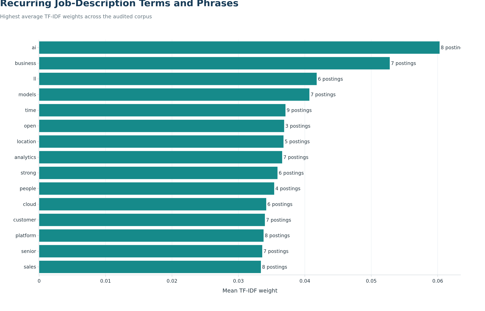
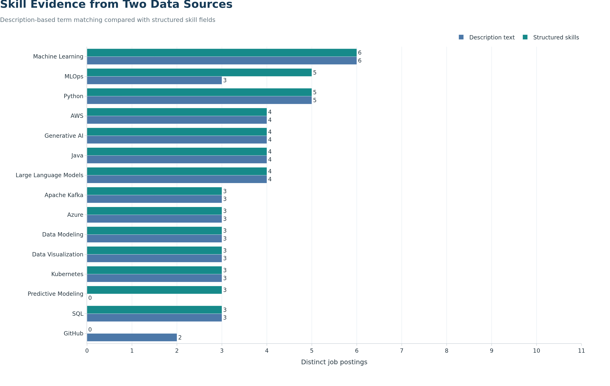

## Objective

We use natural language processing to identify recurring language and technical
skills in the descriptions of our 10 audited software-publisher postings. The
analysis complements the structured Lightcast skill fields and helps us assess
whether the narrative descriptions emphasize the same requirements.

Our NLP results are descriptive. With only 10 documents, we do not treat term
frequency as a population-level estimate or train a predictive language model.

## Description Corpus

```{python}
#| label: nlp-load-corpus
#| echo: true

from html import unescape
from pathlib import Path
import re

import numpy as np
import pandas as pd
from IPython.display import Markdown
from IPython.display import display
from sklearn.feature_extraction.text import ENGLISH_STOP_WORDS
from sklearn.feature_extraction.text import TfidfVectorizer

import plotly.graph_objects as go

from plotly_theme import BLUE
from plotly_theme import NAVY
from plotly_theme import TEAL
from plotly_theme import apply_job_market_theme

corpus_path = Path(
    "data/processed/step3/career_market_descriptions.csv"
)
structured_skills_path = Path(
    "data/processed/step3/career_market_skills.csv"
)
figure_dir = Path("figures/step3")
output_dir = Path("outputs/step3")

figure_dir.mkdir(parents=True, exist_ok=True)
output_dir.mkdir(parents=True, exist_ok=True)

corpus = pd.read_csv(
    corpus_path,
    dtype={"JOB_ID": "string"}
)

structured_skills = pd.read_csv(
    structured_skills_path,
    dtype={"JOB_ID": "string"}
)

required_columns = {
    "JOB_ID",
    "TITLE_RAW",
    "ROLE_SEGMENT",
    "BODY"
}

missing_columns = required_columns - set(corpus.columns)

if missing_columns:
    raise ValueError(
        f"The NLP corpus is missing columns: {sorted(missing_columns)}"
    )

if corpus["JOB_ID"].duplicated().any():
    raise ValueError("The NLP corpus must contain one row per JOB_ID.")

if corpus["BODY"].fillna("").str.strip().eq("").any():
    raise ValueError("Every selected posting must have a job description.")


def clean_description(value):
    """Remove markup and normalize text while retaining technical symbols."""
    text = unescape(str(value))
    text = re.sub(r"<[^>]+>", " ", text)
    text = re.sub(r"https?://\S+", " ", text)
    text = re.sub(r"[^A-Za-z0-9+#./-]+", " ", text)
    text = text.lower()
    return " ".join(text.split())


corpus["CLEAN_BODY"] = corpus["BODY"].apply(clean_description)
corpus["NLP_WORD_COUNT"] = corpus["CLEAN_BODY"].str.split().str.len()

corpus_summary = pd.DataFrame({
    "Measure": [
        "Distinct descriptions",
        "Median words per description",
        "Shortest description",
        "Longest description"
    ],
    "Value": [
        corpus["JOB_ID"].nunique(),
        int(corpus["NLP_WORD_COUNT"].median()),
        int(corpus["NLP_WORD_COUNT"].min()),
        int(corpus["NLP_WORD_COUNT"].max())
    ]
})

corpus_summary.to_csv(
    output_dir / "nlp_corpus_summary.csv",
    index=False
)

corpus_summary
```

We remove HTML markup, web addresses, repeated whitespace, and most punctuation.
We preserve symbols such as `+` and `#` because they can be part of technical
skill names. Each posting remains a separate document.

## Recurring Terms and Phrases

```{python}
#| label: nlp-tfidf
#| echo: true

domain_stop_words = {
    "ability",
    "applicant",
    "applicants",
    "company",
    "description",
    "employee",
    "employees",
    "employment",
    "experience",
    "including",
    "job",
    "position",
    "preferred",
    "qualification",
    "qualifications",
    "required",
    "requirements",
    "responsibilities",
    "role",
    "skills",
    "team",
    "teams",
    "work",
    "working",
    "years"
}

tfidf_stop_words = sorted(
    set(ENGLISH_STOP_WORDS).union(domain_stop_words)
)

tfidf_vectorizer = TfidfVectorizer(
    stop_words=tfidf_stop_words,
    ngram_range=(1, 2),
    min_df=2,
    max_df=0.90,
    sublinear_tf=True
)

tfidf_matrix = tfidf_vectorizer.fit_transform(
    corpus["CLEAN_BODY"]
)

tfidf_terms = tfidf_vectorizer.get_feature_names_out()
mean_tfidf = np.asarray(
    tfidf_matrix.mean(axis=0)
).ravel()
document_frequency = np.asarray(
    (tfidf_matrix > 0).sum(axis=0)
).ravel()

tfidf_results = pd.DataFrame({
    "Term or Phrase": tfidf_terms,
    "Mean TF-IDF": mean_tfidf,
    "Posting Count": document_frequency
}).sort_values(
    ["Mean TF-IDF", "Posting Count", "Term or Phrase"],
    ascending=[False, False, True]
).reset_index(drop=True)

tfidf_results["Mean TF-IDF"] = tfidf_results[
    "Mean TF-IDF"
].round(4)

tfidf_results.to_csv(
    output_dir / "nlp_tfidf_terms.csv",
    index=False
)

tfidf_results.head(15)
```

TF-IDF increases the weight of terms that are important to some postings but
not universal across all descriptions. We include one-word and two-word terms,
require appearance in at least two postings, and remove common English and job
advertisement boilerplate words.

```{python}
#| label: nlp-tfidf-chart
#| echo: true
#| output: false

top_tfidf_plot = (
    tfidf_results
    .head(15)
    .sort_values("Mean TF-IDF", ascending=True)
)

fig_tfidf = go.Figure(
    data=go.Bar(
        x=top_tfidf_plot["Mean TF-IDF"],
        y=top_tfidf_plot["Term or Phrase"],
        orientation="h",
        marker={"color": TEAL},
        text=top_tfidf_plot["Posting Count"],
        texttemplate="%{text} postings",
        textposition="outside",
        customdata=top_tfidf_plot[["Posting Count"]].to_numpy(),
        hovertemplate=(
            "%{y}<br>"
            "Mean TF-IDF: %{x:.3f}<br>"
            "Postings: %{customdata[0]}"
            "<extra></extra>"
        )
    )
)

apply_job_market_theme(
    fig_tfidf,
    title="Recurring Job-Description Terms and Phrases",
    subtitle="Highest average TF-IDF weights across the audited corpus",
    x_title="Mean TF-IDF weight",
    y_title="",
    note=(
        "Terms must appear in at least two descriptions; generic job-posting "
        "language is excluded."
    ),
    height=720,
    showlegend=False,
    grid_axis="x"
)

fig_tfidf.write_image(
    figure_dir / "nlp_top_tfidf_terms.png",
    width=1400,
    height=900,
    scale=2
)
```

{fig-alt="Horizontal bar chart showing the fifteen terms or phrases with the highest average TF-IDF weights across ten job descriptions."}

## Description-Based Skill Extraction

We use transparent regular-expression patterns to identify selected technical
skills in each description. A posting is counted once per skill even if the
term appears multiple times. This produces posting prevalence rather than raw
word frequency.

```{python}
#| label: nlp-skill-extraction
#| echo: true

skill_patterns = {
    "Python": r"\bpython\b",
    "SQL": r"\bsql\b",
    "Machine Learning": r"\bmachine learning\b|\bml\b",
    "MLOps": r"\bmlops\b|\bmachine learning operations\b",
    "AWS": r"\baws\b|\bamazon web services\b",
    "Azure": r"\bazure\b",
    "Google Cloud": r"\bgcp\b|\bgoogle cloud\b",
    "Generative AI": r"\bgenerative ai\b|\bgenai\b",
    "Large Language Models": (
        r"\blarge language models?\b|\bllms?\b"
    ),
    "Data Modeling": r"\bdata model(?:ing|ling)\b",
    "Data Visualization": r"\bdata visuali[sz]ation\b",
    "Predictive Modeling": r"\bpredictive model(?:ing|ling)\b",
    "Docker": r"\bdocker\b",
    "Kubernetes": r"\bkubernetes\b|\bk8s\b",
    "Apache Spark": r"\bapache spark\b|\bpyspark\b",
    "Apache Kafka": r"\bapache kafka\b|\bkafka\b",
    "Tableau": r"\btableau\b",
    "Power BI": r"\bpower bi\b",
    "Java": r"\bjava\b",
    "JavaScript": r"\bjavascript\b",
    "Git": r"\bgit\b",
    "GitHub": r"\bgithub\b"
}

description_skill_records = []

for corpus_row in corpus.itertuples(index=False):
    for skill_name, pattern in skill_patterns.items():
        if re.search(pattern, corpus_row.CLEAN_BODY):
            description_skill_records.append({
                "JOB_ID": corpus_row.JOB_ID,
                "Skill": skill_name,
                "Description Mention": 1
            })

description_skill_mentions = pd.DataFrame(
    description_skill_records,
    columns=["JOB_ID", "Skill", "Description Mention"]
)

description_skill_mentions.to_csv(
    output_dir / "nlp_description_skill_mentions.csv",
    index=False
)

description_counts = (
    description_skill_mentions
    .groupby("Skill")["JOB_ID"]
    .nunique()
    .reindex(skill_patterns.keys(), fill_value=0)
)

description_skill_summary = pd.DataFrame({
    "Skill": list(skill_patterns.keys()),
    "Description Posting Count": description_counts.to_numpy()
})

description_skill_summary["Description Prevalence (%)"] = (
    100
    * description_skill_summary["Description Posting Count"]
    / corpus["JOB_ID"].nunique()
).round(1)

description_skill_summary.sort_values(
    ["Description Posting Count", "Skill"],
    ascending=[False, True]
).reset_index(drop=True)
```

## Description Text Compared with Structured Skills

The structured fields and description text are not expected to match perfectly.
Structured skills may represent standardized concepts or inferred labels, while
description matching requires the employer to use one of our explicit terms.

```{python}
#| label: nlp-skill-source-comparison
#| echo: true

structured_skill_aliases = {
    "Generative Artificial Intelligence": "Generative AI",
    "MLOps (Machine Learning Operations)": "MLOps",
    "Kafka": "Apache Kafka",
    "Docker (Software)": "Docker",
    "Spark": "Apache Spark"
}

structured_skills["NORMALIZED_SKILL"] = structured_skills[
    "SKILL"
].replace(structured_skill_aliases)

structured_skills = structured_skills.drop_duplicates(
    subset=["JOB_ID", "NORMALIZED_SKILL"]
)

comparison_records = []

for skill_name in skill_patterns:
    description_ids = set(
        description_skill_mentions.loc[
            description_skill_mentions["Skill"] == skill_name,
            "JOB_ID"
        ]
    )

    structured_ids = set(
        structured_skills.loc[
            structured_skills["NORMALIZED_SKILL"] == skill_name,
            "JOB_ID"
        ]
    )

    comparison_records.append({
        "Skill": skill_name,
        "Description Count": len(description_ids),
        "Structured Count": len(structured_ids),
        "Both Sources": len(description_ids & structured_ids),
        "Description Only": len(description_ids - structured_ids),
        "Structured Only": len(structured_ids - description_ids)
    })

skill_source_comparison = pd.DataFrame(comparison_records)
skill_source_comparison["Largest Source Count"] = (
    skill_source_comparison[[
        "Description Count",
        "Structured Count"
    ]]
    .max(axis=1)
)

skill_source_comparison = skill_source_comparison.sort_values(
    ["Largest Source Count", "Description Count", "Skill"],
    ascending=[False, False, True]
).reset_index(drop=True)

skill_source_comparison.to_csv(
    output_dir / "nlp_skill_source_comparison.csv",
    index=False
)

skill_source_comparison.drop(
    columns="Largest Source Count"
).head(15)
```

```{python}
#| label: nlp-skill-comparison-chart
#| echo: true
#| output: false

skill_comparison_plot = (
    skill_source_comparison[
        skill_source_comparison["Largest Source Count"] > 0
    ]
    .head(15)
    .sort_values(
        ["Largest Source Count", "Skill"],
        ascending=[True, False]
    )
)

fig_skill_comparison = go.Figure()

fig_skill_comparison.add_bar(
    x=skill_comparison_plot["Description Count"],
    y=skill_comparison_plot["Skill"],
    name="Description text",
    orientation="h",
    marker={"color": BLUE},
    text=skill_comparison_plot["Description Count"],
    textposition="outside",
    hovertemplate=(
        "%{y}<br>"
        "Description mentions: %{x} postings"
        "<extra></extra>"
    )
)

fig_skill_comparison.add_bar(
    x=skill_comparison_plot["Structured Count"],
    y=skill_comparison_plot["Skill"],
    name="Structured skills",
    orientation="h",
    marker={"color": TEAL},
    text=skill_comparison_plot["Structured Count"],
    textposition="outside",
    hovertemplate=(
        "%{y}<br>"
        "Structured skill records: %{x} postings"
        "<extra></extra>"
    )
)

fig_skill_comparison.update_layout(barmode="group")

apply_job_market_theme(
    fig_skill_comparison,
    title="Skill Evidence from Two Data Sources",
    subtitle=(
        "Description-based term matching compared with structured skill fields"
    ),
    x_title="Distinct job postings",
    y_title="",
    note=(
        "A difference does not necessarily indicate an error: standardized "
        "skills and explicit employer wording capture different evidence."
    ),
    height=760,
    showlegend=True,
    grid_axis="x"
)

fig_skill_comparison.update_xaxes(
    range=[0, corpus["JOB_ID"].nunique() + 1],
    dtick=1
)

fig_skill_comparison.write_image(
    figure_dir / "nlp_skill_source_comparison.png",
    width=1500,
    height=950,
    scale=2
)
```

{fig-alt="Grouped horizontal bars comparing the number of postings associated with each skill in description text and structured Lightcast skill fields."}

## Data-Driven Summary

```{python}
#| label: nlp-dynamic-summary
#| echo: false

top_terms_text = ", ".join(
    tfidf_results.head(5)["Term or Phrase"].tolist()
)

top_description_skills = (
    description_skill_summary
    .sort_values(
        ["Description Posting Count", "Skill"],
        ascending=[False, True]
    )
    .head(5)["Skill"]
    .tolist()
)

top_description_skills_text = ", ".join(top_description_skills)

largest_source_difference = skill_source_comparison.copy()
largest_source_difference["Absolute Difference"] = (
    largest_source_difference["Description Count"]
    - largest_source_difference["Structured Count"]
).abs()

largest_source_difference = largest_source_difference.sort_values(
    ["Absolute Difference", "Skill"],
    ascending=[False, True]
).iloc[0]

display(Markdown(
    f"Our highest-weight recurring terms or phrases include **{top_terms_text}**. "
    f"The most frequently detected skills in description text include "
    f"**{top_description_skills_text}**. The largest difference between the "
    f"two skill sources occurs for **{largest_source_difference['Skill']}**, "
    f"with {int(largest_source_difference['Description Count'])} description "
    f"mentions and {int(largest_source_difference['Structured Count'])} "
    f"structured records."
))
```

The comparison demonstrates why we preserve both sources. Structured fields
provide standardized categories suitable for market-wide counting, while the
description text preserves the employer's wording and context. Agreement
between the two strengthens the evidence that a skill is important; a mismatch
is a prompt for review rather than automatic proof that either source is wrong.

## Career Implications

Description-based NLP gives us an additional check on the priorities identified
in our skill-gap and clustering analyses. Skills that appear in both the text
and structured fields provide the strongest evidence for our learning plan.
Terms appearing only in descriptions can reveal emerging or contextual
requirements, while structured-only skills may reflect standardization or
concepts described indirectly by employers.

We will prioritize repeated cross-source signals when choosing portfolio
projects. For example, an end-to-end project can demonstrate Python and SQL for
analysis, Machine Learning for modeling, MLOps for reproducibility, and a cloud
platform for deployment. This produces evidence of integrated capability rather
than isolated course completion.

## Limitations

The corpus contains only 10 descriptions, including repeated standardized job
titles, so one employer's wording can materially affect the results. TF-IDF
measures textual distinctiveness rather than economic demand or proficiency.
Regular-expression extraction can miss synonyms and can occasionally match a
term outside its intended technical context. We therefore use the NLP results
as supporting evidence alongside structured skill counts, not as a replacement
for the audited market panel.
