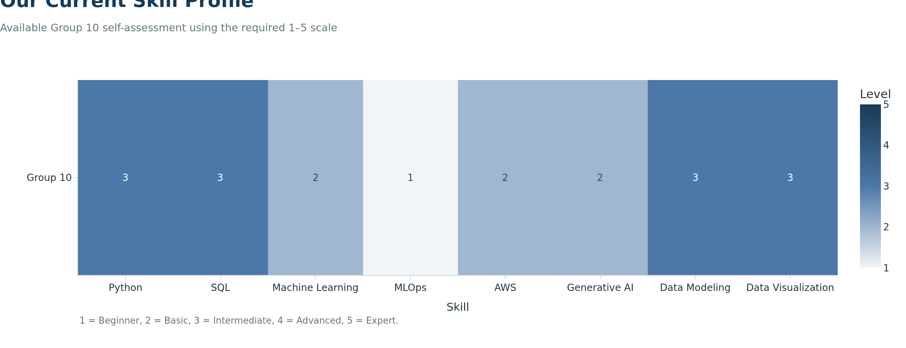
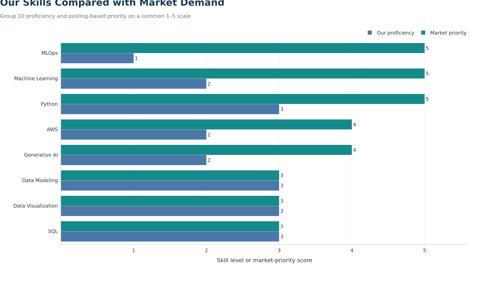

## Skill Profile

At the analysis cutoff, one completed skill self-assessment was available for Group 10. We therefore use the available profile for our group-to-market comparison and do not impute missing proficiency ratings. Our findings represent the skills documented in the available assessment.

```{python}
#| label: group10-skill-profile
#| echo: true

import pandas as pd

skills_data = {
    "Name": ["Group 10"],
    "Python": [3],
    "SQL": [3],
    "Machine Learning": [2],
    "MLOps": [1],
    "AWS": [2],
    "Generative AI": [2],
    "Data Modeling": [3],
    "Data Visualization": [3]
}

df_skills = pd.DataFrame(skills_data)
df_skills = df_skills.set_index("Name")

df_skills
```

## Heatmap

```{python}
#| label: group10-skill-heatmap
#| echo: true

from pathlib import Path

import plotly.graph_objects as go

from plotly_theme import NAVY
from plotly_theme import BLUE
from plotly_theme import apply_job_market_theme

figure_dir = Path("figures/step3")
figure_dir.mkdir(parents=True, exist_ok=True)

skill_values = df_skills.astype(float)

fig_heatmap = go.Figure(
    data=go.Heatmap(
        z=skill_values.values,
        x=skill_values.columns.tolist(),
        y=skill_values.index.tolist(),
        zmin=1,
        zmax=5,
        colorscale=[
            [0.00, "#F1F5F8"],
            [0.50, BLUE],
            [1.00, NAVY]
        ],
        text=skill_values.values,
        texttemplate="%{text:.0f}",
        hovertemplate=(
            "Profile: %{y}<br>"
            "Skill: %{x}<br>"
            "Proficiency: %{z:.0f}/5"
            "<extra></extra>"
        ),
        colorbar={
            "title": "Level",
            "tickvals": [1, 2, 3, 4, 5]
        }
    )
)

apply_job_market_theme(
    fig_heatmap,
    title="Our Current Skill Profile",
    subtitle="Available Group 10 self-assessment using the required 1–5 scale",
    x_title="Skill",
    y_title="",
    note="1 = Beginner, 2 = Basic, 3 = Intermediate, 4 = Advanced, 5 = Expert.",
    height=420,
    grid_axis="none"
)

fig_heatmap.write_image(
    figure_dir / "group10_skill_heatmap.png",
    width=1300,
    height=500,
    scale=2
)
```

{fig-alt="Group 10 proficiency ratings from one to five across the selected career skills."}

## Our Skills Compared with Market Demand

```{python}
#| label: group10-market-skill-comparison
#| echo: true

import pandas as pd
import plotly.graph_objects as go

from plotly_theme import BLUE
from plotly_theme import TEAL
from plotly_theme import apply_job_market_theme

panel_path = "data/processed/step3/career_market_panel.csv"
skills_path = "data/processed/step3/career_market_skills.csv"

market_panel = pd.read_csv(panel_path)
market_skills = pd.read_csv(skills_path)

skill_aliases = {
    "Generative Artificial Intelligence": "Generative AI",
    "MLOps (Machine Learning Operations)": "MLOps",
    "Docker (Software)": "Docker",
    "Kafka": "Apache Kafka"
}

market_skills["Skill Display"] = market_skills["SKILL"].replace(
    skill_aliases
)

market_skills = market_skills.drop_duplicates(
    subset=["JOB_ID", "Skill Display"]
)

selected_skills = df_skills.columns.tolist()
total_jobs = market_panel["JOB_ID"].nunique()

market_counts = (
    market_skills
    .groupby("Skill Display")["JOB_ID"]
    .nunique()
    .reindex(selected_skills, fill_value=0)
)

comparison = pd.DataFrame({
    "Skill": selected_skills,
    "Posting Count": market_counts.to_numpy()
})

comparison["Market Demand (%)"] = (
    100 * comparison["Posting Count"] / total_jobs
).round(1)


def calculate_market_priority(demand_percent):
    if demand_percent >= 50:
        return 5
    if demand_percent >= 40:
        return 4
    if demand_percent >= 30:
        return 3
    if demand_percent >= 20:
        return 2
    return 1


comparison["Market Priority"] = [
    calculate_market_priority(value)
    for value in comparison["Market Demand (%)"]
]

our_levels = pd.to_numeric(
    df_skills.iloc[0],
    errors="coerce"
).reindex(selected_skills)

if our_levels.isna().any():
    raise ValueError("Every Group 10 proficiency rating must be completed.")

if not our_levels.between(1, 5).all():
    raise ValueError("Every proficiency rating must be between 1 and 5.")

comparison["Our Proficiency"] = our_levels.to_numpy()

comparison["Priority Gap"] = (
    comparison["Market Priority"] - comparison["Our Proficiency"]
).clip(lower=0).astype(int)


def classify_learning_priority(gap):
    if gap >= 2:
        return "High"
    if gap == 1:
        return "Moderate"
    return "Maintain"


comparison["Learning Priority"] = [
    classify_learning_priority(value)
    for value in comparison["Priority Gap"]
]

comparison_plot = comparison.sort_values(
    ["Priority Gap", "Market Priority", "Skill"],
    ascending=[True, True, False]
).reset_index(drop=True)

fig_comparison = go.Figure()

fig_comparison.add_bar(
    x=comparison_plot["Our Proficiency"],
    y=comparison_plot["Skill"],
    name="Our proficiency",
    orientation="h",
    marker={"color": BLUE},
    text=comparison_plot["Our Proficiency"],
    textposition="outside",
    hovertemplate=(
        "%{y}<br>"
        "Our proficiency: %{x}/5"
        "<extra></extra>"
    )
)

fig_comparison.add_bar(
    x=comparison_plot["Market Priority"],
    y=comparison_plot["Skill"],
    name="Market priority",
    orientation="h",
    marker={"color": TEAL},
    text=comparison_plot["Market Priority"],
    textposition="outside",
    customdata=comparison_plot[["Market Demand (%)", "Posting Count"]],
    hovertemplate=(
        "%{y}<br>"
        "Market priority: %{x}/5<br>"
        "Mentioned by %{customdata[1]} postings "
        "(%{customdata[0]:.0f}%)"
        "<extra></extra>"
    )
)

fig_comparison.update_layout(barmode="group")

apply_job_market_theme(
    fig_comparison,
    title="Our Skills Compared with Market Demand",
    subtitle="Group 10 proficiency and posting-based priority on a common 1–5 scale",
    x_title="Skill level or market-priority score",
    y_title="",
    note=(
        "A positive gap means market priority exceeds our current proficiency. "
        f"Market demand is based on {total_jobs} audited postings."
    ),
    height=650,
    showlegend=True,
    grid_axis="x"
)

fig_comparison.update_xaxes(
    range=[0, 5.6],
    tickvals=[1, 2, 3, 4, 5]
)

fig_comparison.write_image(
    figure_dir / "group10_market_skill_comparison.png",
    width=1400,
    height=800,
    scale=2
)

comparison.sort_values(
    ["Priority Gap", "Market Priority"],
    ascending=[False, False]
).reset_index(drop=True)
```

{fig-alt="Grouped horizontal bars comparing Group 10 proficiency with posting-based market priority for each selected skill."}

## Interpretation of Our Skill Gaps

We calculate market demand using the percentage of distinct postings that
mention each skill. We convert this percentage to a five-point market-priority
score: 50% or more receives 5, 40–49% receives 4, 30–39% receives 3,
20–29% receives 2, and less than 20% receives 1. This is a project-defined
planning scale and should not be interpreted as an employer proficiency rating.

Our largest identified gap is MLOps, where the market-priority score exceeds
our current proficiency by four points. Machine Learning has a three-point
gap. Python, AWS, and Generative AI each have two-point gaps. Our current
ratings in SQL, Data Modeling, and Data Visualization meet the corresponding
market-priority benchmarks.

These results suggest that we should first strengthen the skills required to
build, operationalize, and deploy machine-learning systems. We should continue
practicing SQL, Data Modeling, and Data Visualization so that these existing
strengths are maintained.

## Our Improvement Plan

| Priority | Skill | Gap | Planned action | Evidence of progress |
|---|---:|---:|---|---|
| 1 | MLOps | 4 | Learn experiment tracking, model versioning, packaging, and deployment using the [MLflow tutorials](https://mlflow.org/docs/latest/ml/getting-started/). | A reproducible pipeline with tracked experiments and saved model artifacts |
| 2 | Machine Learning | 3 | Complete relevant modules in the [scikit-learn MOOC](https://inria.github.io/scikit-learn-mooc/) and apply clustering and model evaluation to our project data. | A notebook containing validation results and model diagnostics |
| 3 | Python | 2 | Refactor our data-processing code into reusable functions with validation checks. | Documented scripts that reproduce the processed data |
| 4 | AWS | 2 | Complete relevant training through [AWS Skill Builder](https://skillbuilder.aws/) and review storage and deployment workflows. | An architecture diagram and deployment notes |
| 5 | Generative AI | 2 | Study the [Hugging Face LLM Course](https://huggingface.co/learn/llm-course/chapter1/1) and test skill extraction from job descriptions. | A small NLP prototype evaluated against the structured skill fields |

## How We Will Organize the Work

We will manage the improvement plan through GitHub issues, documented scripts,
and clearly labeled commits. Reproducible instructions will allow every part
of the analysis to be reviewed and rerun. Because only one completed
self-assessment was available at the analysis cutoff, we do not assign or
impute ratings for an unavailable assessment. If another completed assessment
becomes available, we can add it as another row in the skill dataframe and
regenerate both figures.

## Limitations

Our conclusions are based on ten audited postings, so individual postings can
substantially affect the demand percentages. The proficiency ratings are also
self-reported. Consequently, the priority gaps should be treated as planning
indicators rather than precise measurements of ability or employer
expectations.

